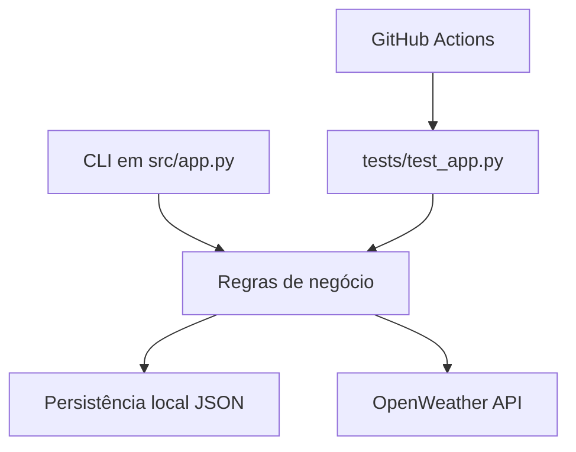

# Arquitetura atual

Este documento descreve o estado atual do GastoSmart antes da engenharia dos requisitos da entrega final.

## Componentes



## Camadas atuais

### Interface CLI

Arquivo principal: `src/app.py`.

Responsável por:

- exibir menu;
- coletar entradas do usuário;
- chamar funções de negócio;
- imprimir resultados no terminal.

### Regras de negócio

Também estão em `src/app.py` neste momento.

Funções principais:

- `adicionar_gasto`
- `listar_gastos`
- `remover_gasto`
- `resumo_gastos`
- `buscar_clima`

Para a entrega final, pode valer a pena separar a aplicação em módulos menores antes ou durante a migração para banco de dados.

### Persistência

O projeto ainda usa arquivo JSON local.

Padrão:

```text
data/gastos.json
```

O caminho pode ser alterado com:

```text
GASTOSMART_DATA_FILE
```

Essa persistência local é suficiente para a base atual, mas deverá ser substituída ou adaptada para banco de dados em nuvem na entrega final.

### Integração externa

A função `buscar_clima` consome a API OpenWeather quando `OPENWEATHER_API_KEY` está configurada. Sem chave, o app segue funcionando sem clima.

### Testes

Os testes ficam em `tests/test_app.py` e cobrem:

- criação de gastos;
- listagem;
- remoção;
- resumo por categoria;
- persistência local;
- integração com OpenWeather usando mock.

### CI

O workflow `.github/workflows/ci.yml` roda:

- `ruff check src/ tests/`
- `pytest tests/ -v`

## Próximos cuidados arquiteturais

- Evitar misturar regra de negócio com detalhes do banco em nuvem.
- Criar uma camada de repositório quando a persistência for migrada.
- Manter testes unitários independentes de rede e de banco real.
- Criar testes de integração controlados para o banco escolhido.

