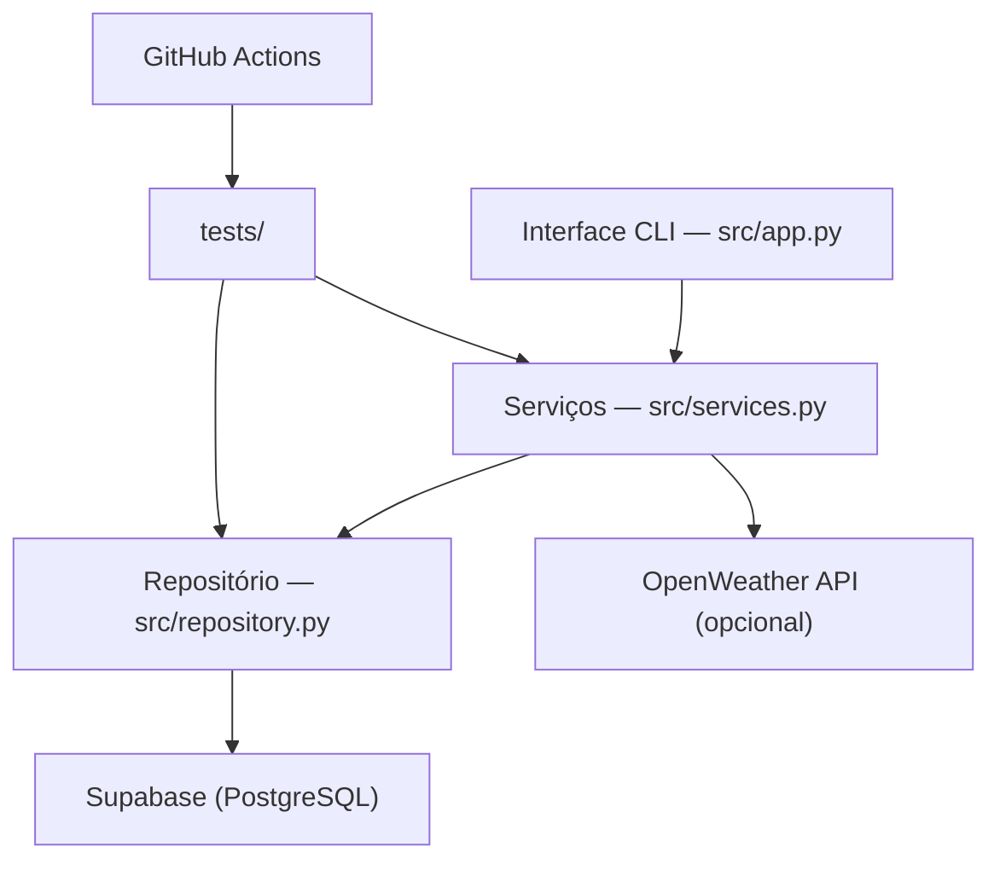

# Arquitetura — GastoSmart (entrega final)

## Visão geral

O GastoSmart segue uma arquitetura de 3 camadas: interface CLI, serviços e repositório.
Cada camada tem responsabilidade única e pode ser testada de forma independente.

## Componentes

## Camadas

### 1. Interface CLI (`src/app.py`)

Responsável por exibir o menu, coletar input do usuário, chamar os serviços
e imprimir resultados no terminal. Não contém regras de negócio.

### 2. Serviços (`src/services.py`)

Contém as regras de negócio da aplicação:

- `adicionar_gasto`
- `listar_gastos`
- `remover_gasto`
- `resumo_gastos`
- `buscar_clima` (opcional, depende de `OPENWEATHER_API_KEY`)

### 3. Repositório (`src/repository.py`)

Única camada que importa `supabase`. Isola toda a comunicação com o banco.
Funções: `inserir`, `listar`, `remover_por_id`.

## Persistência

Supabase (PostgreSQL) hospedado em nuvem. O arquivo JSON local (`data/gastos.json`)
era legado e foi desativado após o PR-02.

## Integração externa

A função `buscar_clima` consome a API OpenWeather apenas quando
`OPENWEATHER_API_KEY` está configurada. Sem a chave, o app funciona normalmente.

## Testes e CI

Os testes ficam em `tests/` e cobrem serviços e repositório com mocks.
O workflow `.github/workflows/ci.yml` roda `ruff` e `pytest` em todo PR.